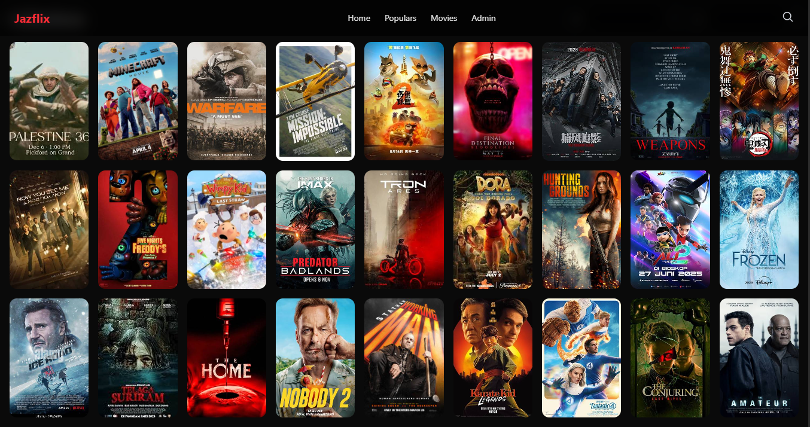

# Jazflix

Jazflix is an **online educational streaming platform** designed to deliver learning content in a simple, scalable, and user-friendly way.

> ⚠️ For education purposes only.

---

## 🚀 Features

- Video streaming for learning content
- Organized courses & playlists
- Responsive UI (desktop & mobile)
- Optimized for performance
- Secure access (auth-ready)

---

## 🛠 Tech Stack

- Frontend: React
- Backend: Node.js
- Database: MongoDB
- Video: Embedded / Streaming-ready
- Deployment: Cloud-ready (AWS compatible)

---

## 📌 Purpose

Jazflix was built to:

- Make educational content easier to access
- Simulate a real-world streaming platform
- Demonstrate full-stack architecture

---

## 📷 Preview

---

## ⚠ Warning

For education purposes only.

---
